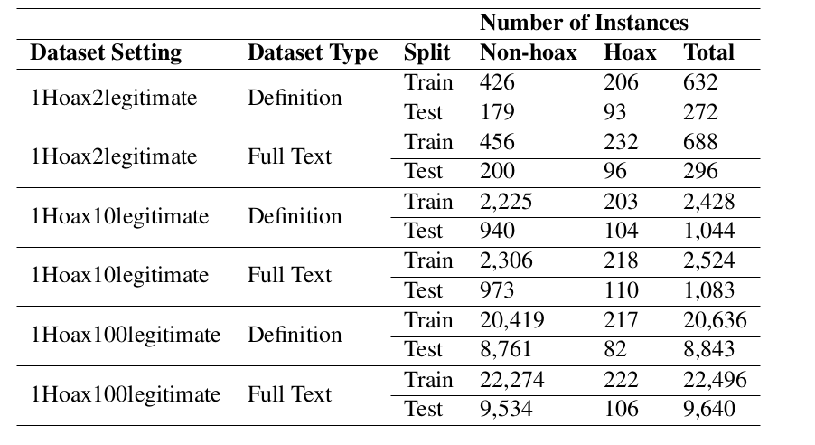

# Hoaxpedia: A Unified Wikipedia Hoax Articles Dataset
_TL:DR: Hoaxpedia is a Dataset containing Hoax articles collected from Wikipedia and semantically similar Legitimate article in 2 settings: Fulltext and Definition and in 3 splits based on Hoax:Legit ratio._

We introduce HOAXPEDIA, a collection of 311 hoax articles (from existing literature and official Wikipedia lists), together with semantically similar legitimate articles, which together form a binary text classification dataset aimed at fostering research in automated hoax detection.


## Dataset Description

The Hoaxpedia dataset is a collection of 311 hoax articles, sourced from existing literature and official Wikipedia lists. Each hoax article is paired with a semantically similar legitimate article, creating a binary text classification dataset. The dataset is designed to facilitate research in automated hoax detection.

The dataset is available in two settings: Fulltext and Definition. It is also divided into three splits based on the Hoax:Legit ratio, with ratios of 1:2, 1:10, and 1:100.



### Calling the dataset

To access the dataset, you can use the following code snippet in Python:

```python
from datasets import load_dataset
dataset = load_dataset('hsuvaskakoty/hoaxpedia','datasetSetting_datasetSplit')
```

Remember to replace `'datasetSetting_datasetSplit'` with the specific split you want to load. Here are the available splits:

- Setting: Fulltext, Definition
- Split: 1h2r, 1h10r, 1h100r

## Function to extract the Legitimate articles from the dataset

By default, the dataset comes with n number of real articles. However, we can also extract the Legitimate articles from the dataset by calling the following function:

```python
python collect_real.py  --data_path ../data/hoax_unified_v4.csv 
                        --output_path ../data
```

Where the hoax articles are already given in the data folder. The function will extract the Legitimate articles from the dataset and save them in the data folder.

## Classification of Language Model

The following function will call the Language Models in training to classify the articles into Hoax and Legitimate articles.

```python
python classifier.py --input_train_path ../data/INPUT_TRAIN_PATH.csv 
                     --input_test_path ../data/INPUT_TEST.csv 
                     --output_path ../data 
                     --task definition 
                     --huggingface_key <key> 
                     --repo_id <repo_id>

```


## Citation

If you use our dataset, please cite our paper:

```bibtex
@article{borkakoty2024hoaxpedia,
  title={Hoaxpedia: A Unified Wikipedia Hoax Articles Dataset},
  author={Borkakoty, Hsuvas and Espinosa-Anke, Luis},
  journal={arXiv preprint arXiv:2405.02175},
  year={2024}
}
```